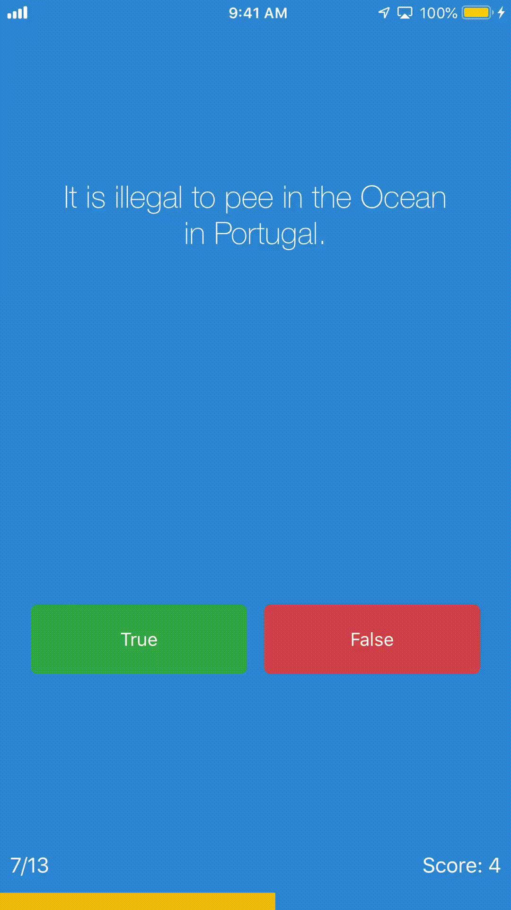

# Quizzler
Using Model-View-Controller (MVC) Design Pattern to make a quiz app.

- Simple quiz app exercising MVC design pattern.

### Skills
* Auto Layout
* Model-View-Controller (MVC) Design Pattern
* CocoaPods(ProgressHUD)
* UIAlertController
* Objective-C

## Finished App

Copyright © Hector Mendoza
